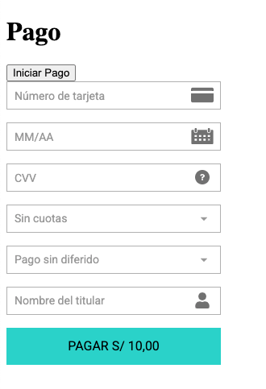

# Vista de formulario

## Integración
Para incrustar el formulario en su proyecto simplemente necesita crear un ```<div>``` con ```id="izipay-form"``` 

**Vista**
```html{1}
<div id="izipay-form"></div>

<!--Boton para activar el Form-->
<button onclick="setup(callBack)">Iniciar Pago</button>
```

**JavaScript**

Importamos la funcion ```setup()``` de ```@dankira/izipay```

```js{1,7}
import { setup, setInitialConfig, setPaymentConfig } from '@dankira/izipay'

setInitialConfig({...})
setPaymentConfig({...})

const callBack = async (payment) => {
    console.log(payment) /* Información del pago */
}
```

Si no se proporciona una función ```callback```, no veremos la respuesta, pero la transacción se ejecutará de todas formas.

## Vista previa


Listo! ✅